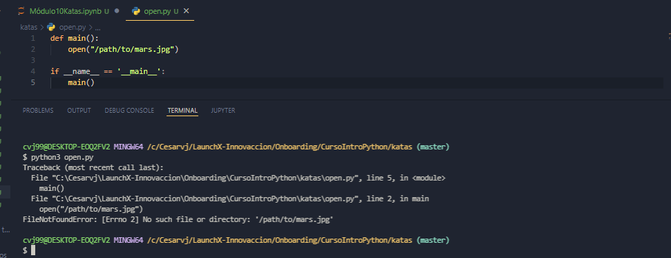
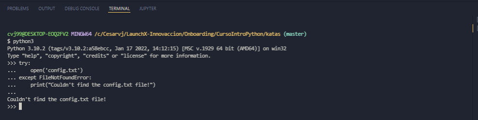
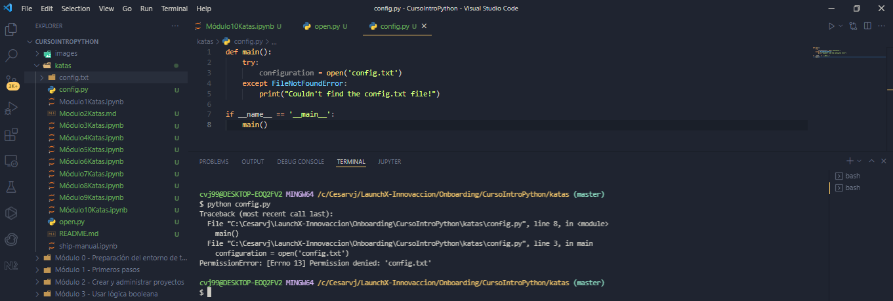
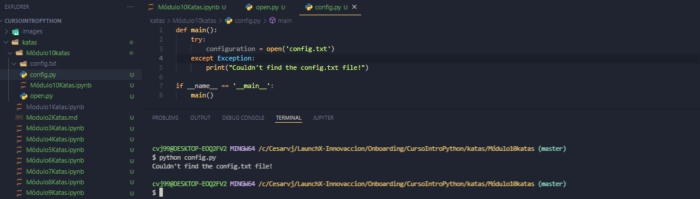
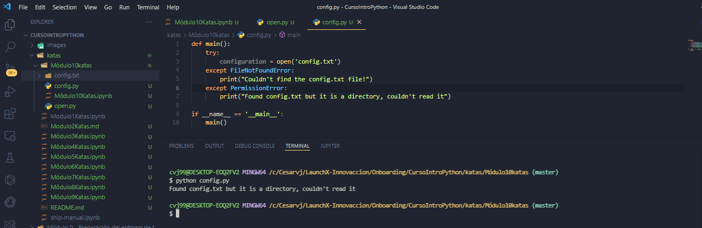
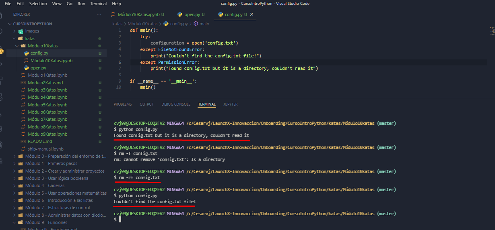
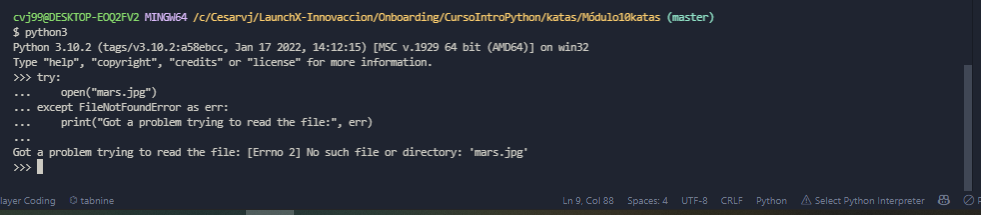
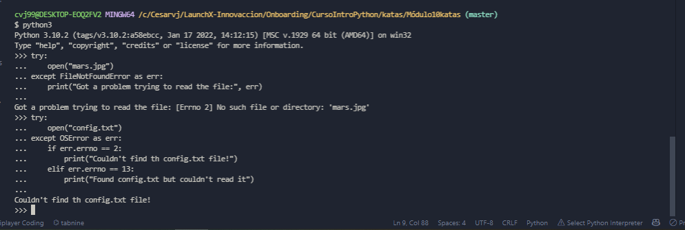

# Kata 10: Manejo de errores

## Capturas de ejecución de ejercicios en consola

Ejecución de archivo open.py para abrir archivo inexistente

Uso de try except desde consola, para mostrar mensaje de archivo no encontrado

Ejecución de archivo config.py

Controlando Exception desde config.py

Mostrando mensaje de que es un directorio y no se puede leer

Utilizando FIleNotFoundError y PermissionError, después de borrar config.txt

Utilizando FileNotFoundError as err para mostrar mensaje de error al usuario

Utilizando OSError y su atributo errno para mostrar mensajes de error

